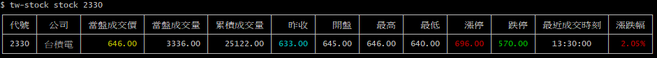
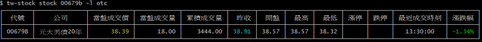
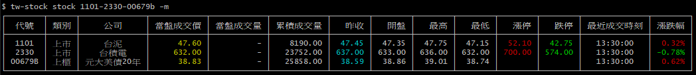
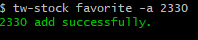
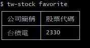

# tw-stock

This command use in my daily qucikly search stock information.

# How to install:

```js
npm install -g tw-stock
```

# How to update stock.json:

```sheel
tw-stock update
```

# How to use:

```sheel
tw-stock stock <stock_code>
```

`<stock_code>` input your search tw_stock_code

| Options       | Description                            |
| ------------- | -------------------------------------- |
| -l --listed   | input this tw_stock_code is tse or otc |
| -m --mutiple  | search multiple stock_code             |
| -f --favorite | show stocks in favorite list           |

# How to use favorite:

```sheel
tw-stock favorite
```

| Options     | Description                        |
| ----------- | ---------------------------------- |
| -c --create | create favorite file.              |
| -a --add    | add stockCode in favorite file.    |
| -d --delete | delete stockCode in favorite file. |

# Search Tse Stock



# Search Otc Stock



# Search Multiple Stock



# Add Stock in Favorite List



# Show Favorite List


